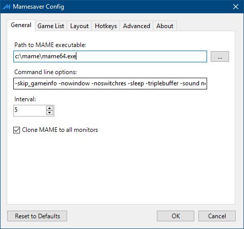
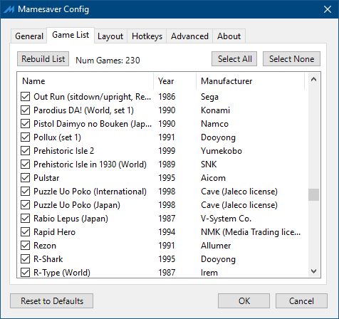
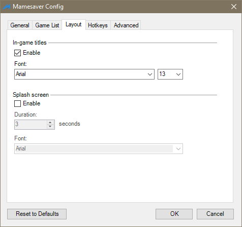
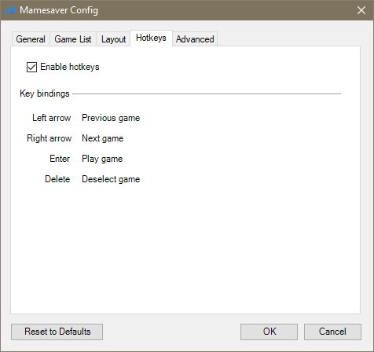
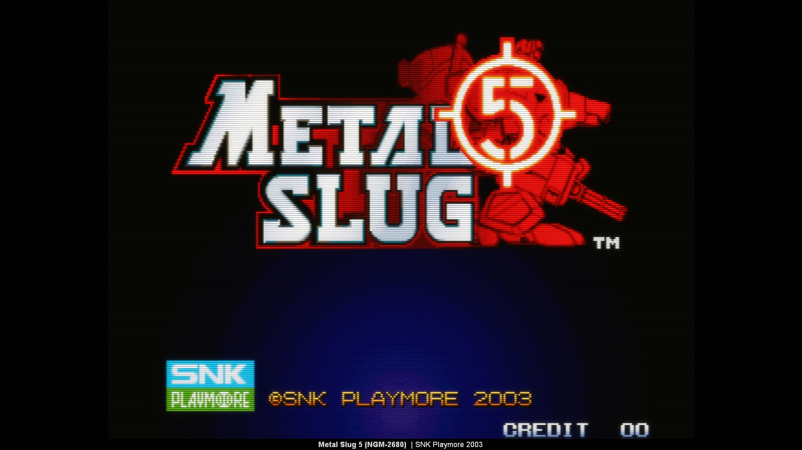

# Mamesaver

- [Introduction](#introduction)
- [Requirements](#requirements)
- [Installation](#installation)
- [Usage](#usage)
- [Configuration](#configuration)
- [Hotkeys](#hotkeys)
- [Comments](#comments)
- [Logging](#logging)
- [Contributors](#contributors)
- [Open source](#open-source)

v2.0
Licensed under The MIT License

### INTRODUCTION

Mamesaver is a Windows screen saver that runs MAME with a random game for specified intervals of time.

  
 

 

### REQUIREMENTS
* Microsoft .NET 4.6
* A working installation of MAME. I used 0.200 but older ones will probably work too.
* Some working ROMS which can run in MAME successfully.
* Each ROM that is installed should have been run at least once to remove the initial disclaimer screen as this is the last thing you want to see when the screen saver is running.

### INSTALLATION
Install using the msi installer, or just copy the `Mamesaver.scr` file to your `WINDOWS\SYSTEM32` or `WINNT\SYSTEM32` directory.

### USAGE

Right-click on your desktop and choose Properties. Once the Display Properties dialog has opened navigate to the Screen Saver tab. There you need to choose Mamesaver as your screen saver.

### CONFIGURATION

The first time you choose Mamesaver as your screen saver, you will need to configure it to tell it the right path to MAME and to rebuild your game list. To do this, you need to click on the Settings button on the screen saver dialog (Display Properties dialog) as mentioned in USAGE.

You have a couple of choices for settings on Mamesaver. The most important setting in the beginning is the MAME Path on the General tab. Once this is set you can navigate to the Game List tab and click on Rebuild List. Once this has been run, please select which games you want Mamesaver to run. When you have finished, you may click the OK button.

Other than those main settings, you can also:

* Set the interval at which the game is changed for another; minimum 2 minutes, maximum 1440 minutes (24 hours)
* Set the command line options which are sent to MAME. I recommend leaving the `-skip_gameinfo` option.
* Enable and configure the splash screen with game information
* Enable and configure in-game game information
* Enable multi-monitor cloning
* Include games with imperfect emulation
* Enable in-game hotkeys

### HOTKEYS

When enabled, the following hotkeys are enabled in-game:

* <kbd>←</kbd> show previous game 
* <kbd>→</kbd> show next game
* <kbd>enter</kbd> exit screensaver and play game
* <kbd>del</kbd> deselect game

### COMMENTS

* Including games with imperfect emulation should only be enabled for custom builds of MAME. Unless this is enabled, the game list will only contain games which have passed the MAME ROM audit and have drivers with a status of good. This means that games, which might be partially working but maybe have no sound or some other part of the driver is not working, will not be displayed in this list. The main reason for this is that MAME shows a dialog which expects user input at the beginning of the game, which is the exact opposite of what you would want a screen saver to do.

### LOGGING

If enabled, debug logging is written to `%TEMP%\MameSaver\Logs`. This can be useful to diagnose why Mamesaver may not be running as it should. 

### CONTRIBUTORS
 Mladen Mihajlovic

 Matt Painter

 Andy van Stokkum

### OPEN SOURCE
The source code if provided as-is under the MIT Licence. If you have any suggestions and comments, please feel free to create issues here on github.
